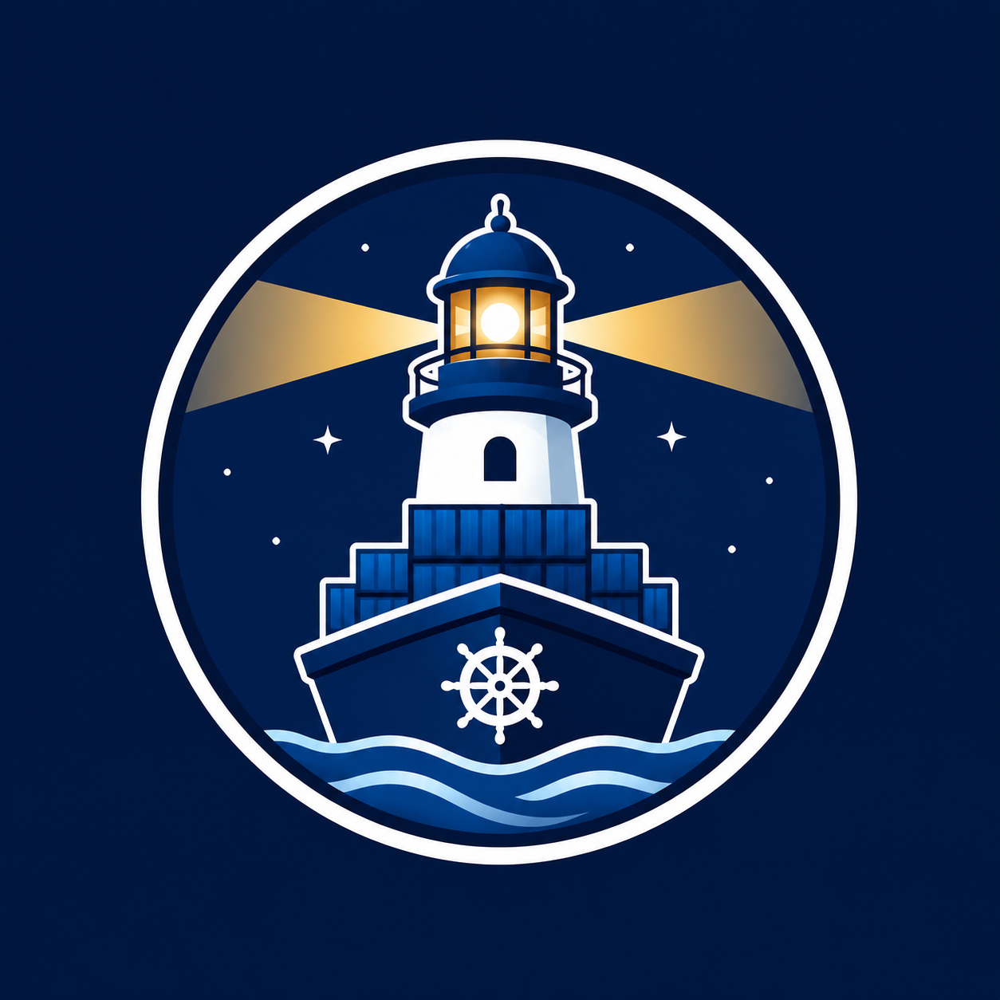

<div align="center">



# Harbormaster

**The container update manager that asks before it acts.**

Watchtower auto-updates. Harbormaster checks, fetches the changelog, taps you on the shoulder, and only updates after you say yes — from Telegram or a sleek web dashboard.

[](https://github.com/meltingice1337/harbormaster/actions/workflows/release.yaml)
[](LICENSE)
[](https://github.com/users/meltingice1337/packages/container/package/harbormaster)

</div>

---

## Why?

Auto-updating your homelab is great — until a release breaks something at 3 AM and you can't roll back because the prod compose stack moved on. Harbormaster keeps you in the loop:

- 🔔 **Asks before it updates.** Every pending image gets its own Telegram message with `Update` / `Skip` buttons. You stay in control.
- 📝 **Knows what changed.** Reads each container's `org.opencontainers.image.source` OCI label, derives the GitHub repo, and shows you the actual release notes before you tap Update.
- 🎯 **Per-container decisions.** Approve the boring patch, skip the risky major bump, defer the one that always breaks your dashboards.
- 🖥️ **Sleek dashboard.** Dark UI, live stats, recent activity, per-container actions. Drops into [homepage](https://gethomepage.dev) via a `customapi` widget.
- 📦 **One container.** No Home Assistant, no webhook plumbing, no two-watchtower contraption. Telegram long-polling means it works from anywhere behind NAT.

## Architecture

```
┌─────────────────────────────────────────────────────────────────────┐
│                       harbormaster (this app)                       │
│  ┌────────────┐   ┌───────────────┐   ┌─────────────────────────┐   │
│  │ Scheduler  │──▶│  Orchestrator │──▶│   Web UI    │ Telegram  │   │
│  │  (croner)  │   │  • scan       │   │   (Next.js  │   bot     │   │
│  │            │   │  • apply      │   │    + axum-  │ (telegraf │   │
│  │            │   │  • skip       │   │    style    │  long-    │   │
│  │            │   │               │   │    routes)  │  poll)    │   │
│  └────────────┘   └──┬─────────┬──┘   └──────┬──────┴─────┬─────┘   │
│                      │         │             │            │         │
│                      ▼         ▼             ▼            ▼         │
│              ┌──────────┐ ┌────────────┐ ┌──────────┐ ┌─────────┐   │
│              │  Docker  │ │  Registry  │ │  GitHub  │ │ /data/  │   │
│              │  socket  │ │  HEAD man- │ │ Releases │ │ state.  │   │
│              │ (bollard │ │  ifest API │ │   API    │ │  json   │   │
│              │ dockero- │ │            │ │ + Servarr│ │ (skipped│   │
│              │  de)     │ │            │ │ endpoint │ │ + log)  │   │
│              └──────────┘ └────────────┘ └──────────┘ └─────────┘   │
└─────────────────────────────────────────────────────────────────────┘
```

## Quick start

### 1. Create a Telegram bot

Message [@BotFather](https://t.me/BotFather) → `/newbot` → save the token. Then message your bot once and grab your chat ID:

```bash
curl "https://api.telegram.org/bot<TOKEN>/getUpdates" | jq '.result[].message.from.id'
```

### 2. Add to your `docker-compose.yaml`

```yaml
harbormaster:
  image: ghcr.io/meltingice1337/harbormaster:latest
  container_name: harbormaster
  environment:
    - TZ=Europe/Bucharest
    - HM_TELEGRAM_BOT_TOKEN=${HM_TELEGRAM_BOT_TOKEN}
    - HM_TELEGRAM_CHAT_IDS=${HM_TELEGRAM_CHAT_IDS}
    - HM_WATCH=homeassistant,jellyfin,sonarr,prowlarr
    - HM_SCHEDULE=0 0 6 * * 0          # every Sunday at 06:00 local
    - HM_WEB_AUTH_TOKEN=${HM_WEB_AUTH_TOKEN}
  volumes:
    - /var/run/docker.sock:/var/run/docker.sock
    - ./harbormaster/data:/data
  ports:
    - "9099:8000"
  restart: unless-stopped
  labels:
    - homepage.group=Infrastructure
    - homepage.name=Harbormaster
    - homepage.icon=mdi-anchor
    - homepage.href=http://192.168.0.200:9099
    - homepage.description=Container Update Manager
```

### 3. Bring it up

```bash
docker compose up -d harbormaster
open http://<host>:9099
```

That's it. The dashboard shows everything; the next scheduled scan will DM you when updates land.

## Configuration

### Environment variables

| Variable | Required | Default | Description |
|---|---|---|---|
| `HM_TELEGRAM_BOT_TOKEN` | for bot | — | Bot token from @BotFather. Omit to run web-only. |
| `HM_TELEGRAM_CHAT_IDS` | for bot | — | Comma-separated chat IDs allowed to interact and receive notifications. |
| `HM_TELEGRAM_ADMIN_CHAT_ID` | no | first ID | Chat that receives "unauthorized user tried to access" notices. |
| `HM_SCHEDULE` | no | `0 0 6 * * 0` | **6-field** cron (`s m h dom mon dow`). Every Sunday at 06:00 by default. |
| `HM_WATCH` | no | _all running_ | Comma-separated container names to watch. Empty = all running except self. |
| `HM_GITHUB_TOKEN` | no | — | PAT to raise GitHub API rate limit from 60 → 5000 req/hr. |
| `HM_WEB_AUTH_TOKEN` | recommended | — | Bearer/cookie auth for the dashboard. Unset = public (warning logged). |
| `HM_CHANGELOG_<name>` | no | _auto_ | Override changelog source per container. `github:owner/repo`, `servarr:<branch>`, or `none`. |
| `TZ` | no | `UTC` | Timezone for the scheduler. |
| `LOG_LEVEL` | no | `info` | `debug` / `info` / `warn` / `error`. |

### Telegram commands

| Command | What it does |
|---|---|
| `/check` | Scan for updates now and send pending ones as approval messages. |
| `/list` | All watched containers + current versions. |
| `/status` | Last/next scan times, pending count, schedule. |
| `/help` | This list. |

## Homepage integration

Two ways to surface harbormaster in [homepage](https://gethomepage.dev):

**As a tile** (labels above already do this).

**As a live widget** showing watched / pending counts — add to your `services.yaml`:

```yaml
- Harbormaster:
    href: http://192.168.0.200:9099
    icon: mdi-anchor
    widget:
      type: customapi
      url: http://192.168.0.200:9099/api/widget
      mappings:
        - field: pending
          label: Pending
        - field: watched
          label: Watched
        - field: last_check
          label: Last check
```

`/api/widget` is unauthenticated so homepage can hit it without secrets — it only exposes counts.

## How updates work

```
1. SCAN     for each container in HM_WATCH:
            • read OCI labels (image, version, source repo)
            • HEAD the registry manifest → remote digest
            • if local digest ≠ remote → pending
            • if pending → fetch GitHub Releases since current version

2. NOTIFY   for each pending update:
            • one Telegram message per container
            • [Update] [Skip] inline keyboard
            • changelog excerpt + link to full notes

3. APPROVE  you tap [Update]:
            • docker pull <image>
            • docker stop <container>  (graceful, 30s)
            • docker rm
            • docker create with original Config + HostConfig + Labels
            • docker start
            • Telegram confirmation back to you
```

Recreation preserves every label including `com.docker.compose.*`, so `docker compose up -d` after the fact sees no drift.

## Development

```bash
yarn install
yarn dev                                  # next dev on :3000
yarn typecheck
yarn lint
yarn build

# CLI helpers (need /var/run/docker.sock access):
HM_WATCH=… yarn discover                  # list watched containers + detected sources
HM_WATCH=… yarn check-updates             # compare local vs remote digests
HM_WATCH=… yarn changelog <container>     # fetch changelog for one container
HM_WATCH=… yarn scan                      # full orchestrator scan + state write
```

### Build the image locally

```bash
docker build -t harbormaster:dev .
docker run --rm \
  -e HM_WATCH=homeassistant,jellyfin \
  -v /var/run/docker.sock:/var/run/docker.sock \
  -p 9099:8000 \
  harbormaster:dev
```

## Migrating from watchtower

Two steps:

1. **Soften watchtower** — add `--monitor-only` so it no longer races with harbormaster.
2. **Bring harbormaster up alongside it** — verify it sees your containers (`/api/state` or `/list` on the bot).
3. **Delete watchtower** when you trust harbormaster.

Approving an update from harbormaster does the same thing watchtower would have done (pull + recreate), just gated by your tap.

## Why "harbormaster"?

The person who oversees ships entering and leaving a harbor — decides who comes in, when, and on whose terms. Felt like the right metaphor for a tool that gates which container images get to dock.

## License

MIT — see [LICENSE](LICENSE).
